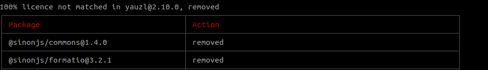
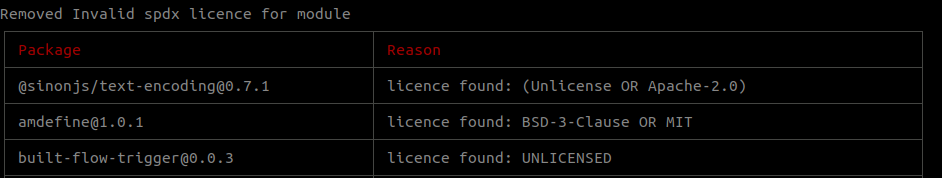

# SpdxValidator
Check if dependent modules in nodejs app is valid as per spdx list of valid licenses.

# [What is spdx ](https://spdx.org/about)
Software Package Data Exchange® (SPDX®) is an open standard for communicating software bill of material information (including components, licenses, copyrights, and security references).

[npm spdxvalidator](https://www.npmjs.com/package/spdxvalidator)

Its this easy:
```
npm i spdxvalidator -g

spdxvalidator --jarPath "spdx_jar_file_path.jar" 
```
# [how to get scan.json](https://github.com/nexB/scancode-toolkit/)
Include scan.json if you want to exclude licence that contains less than 100% match in licence text.


# Org name and creater in spdxConfig.json 
```
{
    "orgName": "org name",
    "createrInfo": "webinfo@org.com",
    "title": "org title",
    "downloadLocation": "PackageDownloadLocation"
}
```

# [Licence file](https://github.com/spdx/LicenseListPublisher/releases)

# It will remove packages that does not contain valid licence name as per spdx


# How does it work?

It scan's all licences in current directory node_modules, from's a list of licenses, creates a spdx file for it and validate it against the jar file specified. 

It's that simple :)

HI its me [deepak](http://github.com/deepak6446), I don't maintain this package if you want to be a contributer, drop me a mail at deepak.r.poojari@gmail.com.
